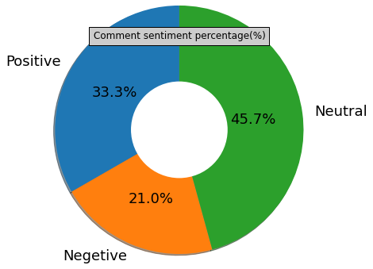

# Automate sentiment analysis tool

### Author : Sazin Reshed Samin

* Email : <sazinsamin50@gmail.com>
Page: <https://sazinsamin.github.io/autosentiment/>


## autosentiment is an open source library that generates sentiment type(positive,negetive,neutral) pie char,percentage,number and ternary value for pandas dataframe text portion.


## - Usage
For analysis the seintiment type in positive,negetive or neutral


## - Setup in normal environment and command window:
```
pip install autosentiment
```


## - Setup in jupyter notebook:
```
!pip install autosentiment
```


## - Import library : 
```
import autosentiment as at
```


## - The library is pandas dataframe dependent.
```
Have to get dataframe('text columns') and give to command.
Like df['text]
```


## Features
### - sentiment type pie chart :
```
at.pie()
```

### - sentiment type amount : 
Get the sentiment type(postive,negetive,neutral numbers)
```
at.number()
```


### - sentiment percentage :
Get the percentage of sentiment type
```
at.percentage() 

```


### at.ternary_analysis
Get the type of all text, here -1:negetive, 0:neutral, 1:positive

```
at.ternary_analysis()
```


### - An example usages

```

>>import autosentiment as at

>>import pandas as pd

>>df=pd.read_csv("/home/samin/anaconda3/dataset_2.csv")

>>percent=at.percentage(df['text'])

>>print(percent)
>>Positve : 33.31 %, Negetive 20.96 %, Neutral : 45.72 %

>>number=at.number(df['text'])

>>print(number)
>>{'positive  ': 1087, 'negetive': 684, 'neutral': 1492}

>>ana=at.analysis_ternary(df['text'])

>>print(ana)
>>[-1, 1, 0.0, 0.0, 0.0, 0.0,.......,1]

>>at.pie(df['text'])


```



* For any bug, please notify in my email : <sazinsamin50@gmail.com>


